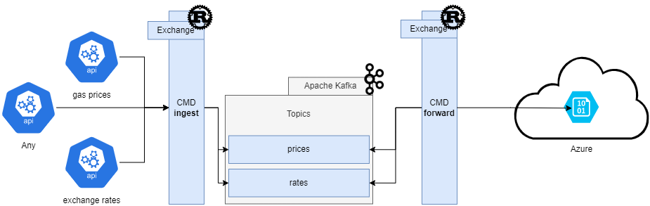

# Exchange - A simple and fast CLI tool built around Kafka

~~~~~~~~~~~~~~~~~~~~~~~~~~~~~~~~~~~~~~~~~~~~~~~~~~
    ______          _                            
   |  ____|        | |                           
   | |__  __  _____| |__   __ _ _ __   __ _  ___ 
   |  __| \ \/ / __| '_ \ / _` | '_ \ / _` |/ _ \
   | |____ >  < (__| | | | (_| | | | | (_| |  __/
   |______/_/\_\___|_| |_|\__,_|_| |_|\__, |\___|
                                       __/ |     
                                      |___/ 
~~~~~~~~~~~~~~~~~~~~~~~~~~~~~~~~~~~~~~~~~~~~~~~~~~

Hey! Exchange is a CLI tool built around Kafka. Although a **portfolio project**, it's pretty useful. You can use it to:

- Ingest JSON API responses and produce it to your Kafka topic.
    - e.g. for gathering data from various APIs and keep track of it in a Kafka topic
- Consume data from any Kafka topic and output it to a defined Azure Blob Storage.
    - e.g. for backup or further processing in Azure Data Factory




Sounds interesting? Let's give it a try! 🚀 [Disclaimer](#Disclaimer)

[Installation](#Installation) | [Usage](#Usage) | [Configuration](#Configuration)

I implemented this project to learn more about Rust and Kafka. Rust gets a lot of interest these days. I think there will be a shift from python-only to python-rust in the near future. The rust crates I used are a bit challenging, especially the azure related ones. (They are not officially supported by Microsoft, yet.)

However, these are some important crates I used:
- rdkafka
- reqwest
- azure_storage
- azure_core

Over the past few weeks I've learned a lot and got really confident with Rust. I'm happy with the result and I hope you like it too! You can refer to my [Progress](Progress.md) for some notes about the development process.

I might add more features in the future. If you have any ideas, feel free to open an issue or contact me [Links](https://github.com/juweins)!

## Disclaimer

**This project is not production ready. It's a portfolio project and I'm not responsible for any data loss or other issues. Use at your own risk!**
<br></br>

## Installation

First of all, thank you for your interest in my project! I'm glad you're here. I'm going to assume you have a Kafka cluster running somewhere. If you don't, you can use [Confluent's Docker image](https://hub.docker.com/r/confluentinc/cp-kafka/) to get started or use the Apache Kafka [Quickstart](https://kafka.apache.org/quickstart) (recommended!).

If you got a Kafka cluster running, you can install Exchange by cloning this repository and running one of the following commands:

1. From source code (requires cargo and rustc):
```bash
cargo install --path .
```
2. With the pre-built binary:
```bash
curl -L github.com/juweins/portfolio/001_Event_Stream_Processing/binary/exchange -o /usr/local/bin/exchange
```


Since the mandatory config files are initially shipped with this repository, you need to copy them to your home directory:

```bash
cp -r config ~/.config/exchange
```
From this point on you can edit the config files to your liking. You can find more information about the config files in the [Configuration](#configuration) section.

## Usage
This tool is split into two parts: `exchange ingest` and `exchange forward`. The first one is used to ingest data from an API and produce it to a Kafka topic. The second one is used to consume data from a Kafka topic and output it to a Azure Blob Storage. You can use both of them independently or together.
As of **1.0.0**, the tool is designed to run in the foreground. This means, that you need an external orchestration tool to run the tool in the background and execute it on a schedule. CRON is a good option for this.

### Ingest
The `exchange ingest` command is used to ingest data from an API and produce it to a Kafka topic. It's pretty simple to use. You just need to specify the API endpoint, the Kafka topic and the interval at which the data should be ingested. The following command will ingest data from the [CatFacts API](https://catfact.ninja/facts) and produce it to the `test` topic:

```bash
exchange ingest --api-name test_api --topic test
```
or alternatively:
```bash
exchange ingest -a test_api -t test
```

### Forward
The `exchange forward` command is used to consume data from a Kafka topic and output it to a Azure Blob Storage. It's also pretty simple to use. You just need to specify the Kafka topic, the Azure Blob Storage container and a filename used for the blob. The following command will consume data from the `test` topic and output it to the `test` container with the filename `test_data.json`:

```bash
exchange forward --topic test --container-name test --filename test_data.json
```
or alternatively:
```bash
exchange forward -t test -c test -f test_data.json
```

You may also want the blob categorized in a subdirectory. This can be done by prefixing the filename:
`data/test_data.json` will produce a file `test_data.json` in the `data` subdirectory.

### Configuration
The configuration files are located in `~/.config/exchange`. There are three files:
- api_config.json
- kafka_config.json
- azure_config.json

All configuration files can be edited with the builtin `exchange config` command. This command will open the config file currently in nano:

```bash
exchange config -c api_config
```

#### api_config.json
This file contains the API endpoints. It's a JSON file with the following structure:
```json
{
    "test_api": {
        "url": "https://catfact.ninja/fact",
        "apikey": "",
        "description": "This is a test api for the purpose of testing the api module",
        "category": "test"
    }
}
```
The `url` field is the API endpoint. The `apikey` field is the API key. If the API doesn't require an API key, just leave it empty. The `description` field is a description of the API. The `category` field is used to group APIs together (in a upcoming feature). This can be handy to organize the various APIs.

Note: You need a valid API key in order to ingest data from the saved APIs.
- [Exchangerates API](https://exchangeratesapi.io/) (Free plan)
- [Tankerkoenig API](https://creativecommons.tankerkoenig.de/) (Free)

Luckily, I've also included catfact.ninja as a test API. 😸

#### kafka_config.json
This file contains the Kafka configuration. It's a JSON file with the following structure:
```json
{
    "bootstrap_servers": "localhost:9092",
    "group_id": "kafka-node-group",
    "message_timeout_ms": 6000
}
```
The `bootstrap_servers` field is a comma-separated list of Kafka brokers. The `group_id` field is the Kafka consumer group id. The `message_timeout_ms` field sets the timeout for the Kafka consumer. (These are the default values and may not be reflected in the server config.)

#### azure_config.json
This file contains the Azure configurations. It's a JSON file with the following structure:

```json
{
    "storage_account_name": "storageaccountname",
    "storage_account_key": "storageaccountkey",
    "storage_container": "storage-inbound",
    "storage_blob_name": "blob-storage-inbound"
}
```
The `storage_account_key` is mandatory to authenticate to your Azure subscription. The `storage_container` field is the Azure storage container name. The `storage_blob_name` field is the Azure storage blob name.

Note: Flexible use for `storage_container` and `storage_blob_name` are not yet implemented.

## Suggestions, Feedback or even Contributions are welcome! 👍🏽💡