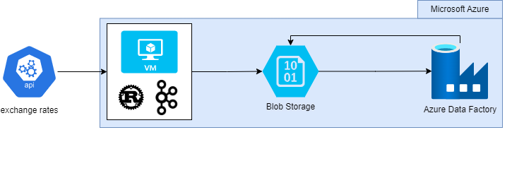

# About this Repository

This repository contains some showcase projects for my personal branding. I am a software developer and I am passionate about programming. I am also a big fan of open source software and I am always looking for new ways to improve my skills. Currently, I am returning to Software Engineering after a personal break where I studied horticultural engineering. 

Please do not hesitate to provide feedback. Suggestions, questions or comments? Feel free to contact me!

## Projects
All of my currently available projects are listed below. The projects **do not** have a specific order, nor do I try to use as many technologies as possible. I am trying to showcase my skills in a way that is easy to understand,fun to read and may expand your knowledge.

### **001 - Event Stream Processing**
In this project, I am using Apache Kafka to ingest data from an API into my Azure Account. The API is a free API from APIlayer. I chose to use a exchange rate API to simulate a real-world use case in which one would like to ingest a unsteady, but continuous stream of data. The data gets processed by a simple Kafka cluster on a azure VM.
I chose to code it in 🦀Rust, since I am currently expanding my knowledge besides 🐍Python (main) and ☕Java.

#### Project overview:

## License
The projects in this repository are licensed under the MIT License. See the [LICENSE](LICENSE) file for details. Feel free to use the code for your own projects. If you do so, please provide a link to this repository.

The visual assets (e.g. project overviews) have been created with [draw.io](https://app.diagrams.net/). The icons used in the project overviews are from builtin icons from draw.io or manually added from the vendors website:

- [Apache Kafka](https://kafka.apache.org/) Icons are licensed under the [Apache License 2.0](https://www.apache.org/licenses/LICENSE-2.0)
- [Rust](https://www.rust-lang.org/) Icons are licensed under the [Apache License 2.0](https://www.apache.org/licenses/LICENSE-2.0)
- [Azure](https://azure.microsoft.com/en-us/) Icons are licensed under the [CC BY 4.0 License](https://creativecommons.org/licenses/by/4.0/) with special attention to the guidelines as stated in [Microsoft Azure Icon Guidelines](https://learn.microsoft.com/en-us/azure/architecture/icons/)

Any other third-party logos may be subject to third-party copyrights and trademarks, and are not available under the same license as the rest of this repository.
